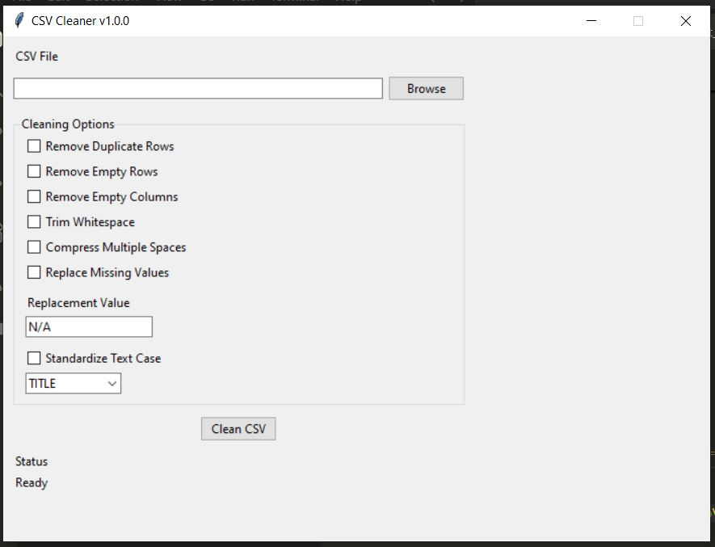
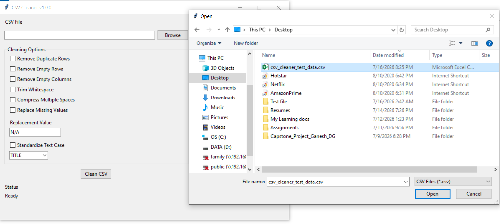
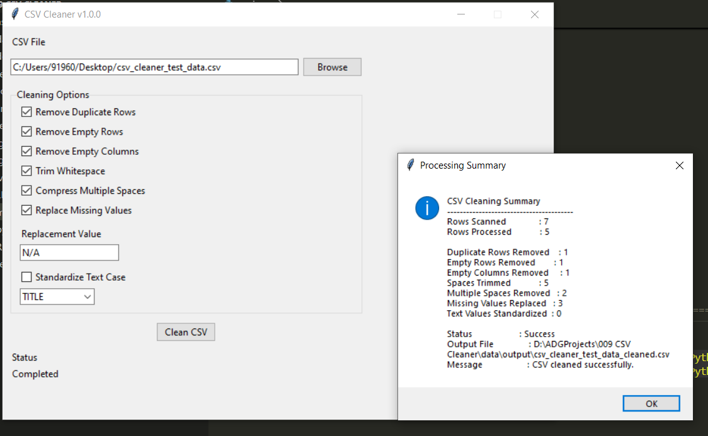
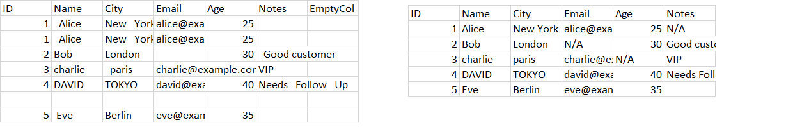
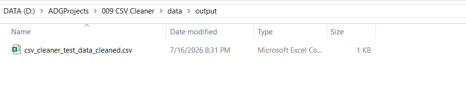

---

# Project Badges


---

# Screenshots

## Home Screen

The application's main interface where users can select a CSV file and choose the required cleaning operations.



---

## File Selection

Browse and select the CSV file to be cleaned using the built-in file picker.



---

## Processing Summary

Displays the processing statistics after the cleaning operation completes successfully.



---

## Input vs Output Comparison

Comparison between the original CSV file and the cleaned output generated by the application.



---

## Output File Created

The cleaned CSV file generated by the application while preserving the original source file.



---

# Project Title

# CSV Cleaner

---

# Project Overview

CSV Cleaner is a desktop utility developed to detect and correct common data quality issues found in CSV files.

The application enables users to clean datasets through a simple graphical interface by removing duplicate records, eliminating empty rows and columns, trimming unnecessary whitespace, replacing missing values, and standardizing text formatting. The cleaned data is exported as a new CSV file while preserving the original source file.

The utility is intended for analysts, developers, testers, students, and business users who regularly work with CSV datasets.

Typical use cases include:

- Cleaning exported reports before analysis
- Preparing datasets for database import
- Standardizing CSV files received from multiple sources
- Removing formatting inconsistencies from manually maintained spreadsheets
- Improving overall data quality before further processing

---

# Features

- Browse and load CSV files
- Validate CSV files before processing
- Remove duplicate rows
- Remove completely empty rows
- Remove completely empty columns
- Trim leading and trailing whitespace
- Compress multiple consecutive spaces into a single space
- Replace missing values using a configurable replacement value
- Standardize text to UPPER, LOWER or TITLE case
- Generate processing statistics
- Preserve the original CSV file
- Export cleaned data as a new CSV file
- Simple desktop graphical interface
- Build standalone Windows executable using PyInstaller

---

# Technology Stack

| Technology | Purpose |
|------------|---------|
| Python 3.14 | Programming Language |
| Tkinter | Desktop User Interface |
| Pandas | CSV Processing |
| pathlib | File and Directory Management |
| dataclasses | Data Models |
| PyInstaller | Executable Packaging |
| Git | Version Control |
| GitHub | Source Code Repository |

---

# Project Structure

```text
CSV-Cleaner/
│
├── main.py
│
├── src/
│   ├── config.py
│   │
│   ├── core/
│   │   ├── cleaning_pipeline.py
│   │   ├── csv_loader.py
│   │   ├── csv_validator.py
│   │   ├── duplicate_cleaner.py
│   │   ├── empty_column_cleaner.py
│   │   ├── empty_row_cleaner.py
│   │   ├── missing_value_cleaner.py
│   │   ├── processing_summary.py
│   │   ├── text_standardizer.py
│   │   └── whitespace_cleaner.py
│   │
│   ├── models/
│   │   ├── cleaning_options.py
│   │   └── processing_result.py
│   │
│   ├── services/
│   │   ├── csv_export_service.py
│   │   └── file_service.py
│   │
│   └── ui/
│       ├── callbacks.py
│       ├── event_handlers.py
│       ├── layout_manager.py
│       ├── main_window.py
│       └── widget_factory.py
│
├── assets/
│
├── data/
│   ├── input/
│   ├── output/
│   └── samples/
│
├── screenshots/
│   ├── file_picker.PNG
│   ├── homescreen.JPG
│   ├── input_vs_output.png
│   ├── output_file_created.PNG
│   ├── poster.png
│   └── result.PNG
│
├── LICENSE
├── README.md
└── requirements.txt
```

---

# Module Overview

| Module | Responsibility |
|---------|----------------|
| **Configuration** | Stores application-wide configuration, constants, and default settings. |
| **UI** | Creates the desktop interface, arranges widgets, and manages user interactions. |
| **Core** | Implements CSV validation, loading, cleaning operations, and processing workflow. |
| **Models** | Represents application data including cleaning options and processing results. |
| **Services** | Provides reusable file management and CSV export functionality. |

---
# Source Code Overview

| Source File | Purpose | Dependencies |
|-------------|---------|--------------|
| **main.py** | Application entry point. Initializes the UI, registers events, and starts the application. | Tkinter |
| **src/config.py** | Stores application configuration, constants, default values, and directory paths. | pathlib |
| **src/core/cleaning_pipeline.py** | Coordinates execution of all selected cleaning operations in the correct sequence. | pandas |
| **src/core/csv_loader.py** | Loads CSV files into Pandas DataFrames. | pandas |
| **src/core/csv_validator.py** | Validates CSV files before processing begins. | pathlib |
| **src/core/duplicate_cleaner.py** | Detects and removes duplicate rows. | pandas |
| **src/core/empty_column_cleaner.py** | Removes columns containing only missing values. | pandas |
| **src/core/empty_row_cleaner.py** | Removes rows containing only missing values. | pandas |
| **src/core/missing_value_cleaner.py** | Replaces missing values using a configurable replacement value. | pandas |
| **src/core/processing_summary.py** | Generates a processing summary after cleaning completes. | None |
| **src/core/text_standardizer.py** | Converts text values to UPPER, LOWER, or TITLE case. | pandas |
| **src/core/whitespace_cleaner.py** | Trims whitespace and compresses multiple spaces within text values. | pandas, re |
| **src/models/cleaning_options.py** | Stores all user-selected cleaning options. | dataclasses |
| **src/models/processing_result.py** | Stores processing statistics and execution results. | dataclasses |
| **src/services/csv_export_service.py** | Exports the cleaned DataFrame to a new CSV file. | pandas, pathlib |
| **src/services/file_service.py** | Provides reusable file and directory operations. | pathlib |
| **src/ui/callbacks.py** | Connects the user interface to the application's business logic. | Tkinter |
| **src/ui/event_handlers.py** | Registers UI event handlers and callback functions. | Tkinter |
| **src/ui/layout_manager.py** | Arranges all user interface controls. | Tkinter |
| **src/ui/main_window.py** | Creates and manages the application's main window. | Tkinter |
| **src/ui/widget_factory.py** | Creates all user interface widgets. | Tkinter |

---

# How to Run

## Clone the Repository

```bash
git clone https://github.com/dg-ganesh/CSV-Cleaner.git
```

## Navigate to the Project Folder

```bash
cd CSV-Cleaner
```

## Install Dependencies

```bash
pip install -r requirements.txt
```

## Launch the Application

```bash
python main.py
```

---

# How to Build

The project can be packaged as a standalone Windows executable using **PyInstaller**.

## Build Command

```bash
pyinstaller ^
--onefile ^
--windowed ^
--name "CSV Cleaner" ^
main.py
```

## Output Location

```text
dist/
└── CSV Cleaner.exe
```

---

# Version

| Item | Value |
|------|-------|
| Project | CSV Cleaner |
| Project ID | 009 |
| Current Version | 1.0.0 |
| Release Date | July 2026 |
| Status | Stable |

---

# Development Workflow

```text
Requirements
      │
      ▼
Software Design Specification (SDS)
      │
      ▼
Standard Python Project Structure (SPPS)
      │
      ▼
Implementation
      │
      ▼
Module Verification
      │
      ▼
Integration Testing
      │
      ▼
Executable Build
      │
      ▼
GitHub Repository
      │
      ▼
GitHub Release
```

---

# Future Enhancements

The following enhancements have been identified for future releases:

- Treat whitespace-only cells as missing values.
- Support Microsoft Excel (.xlsx) files.
- Preview cleaned data before export.
- Allow users to choose the output directory.
- Batch process multiple CSV files.
- Generate detailed data quality reports.
- Display processing progress for large datasets.
- Export processing summary as a text report.

---

# License

This project is licensed under the MIT License.

See the **LICENSE** file for additional details.